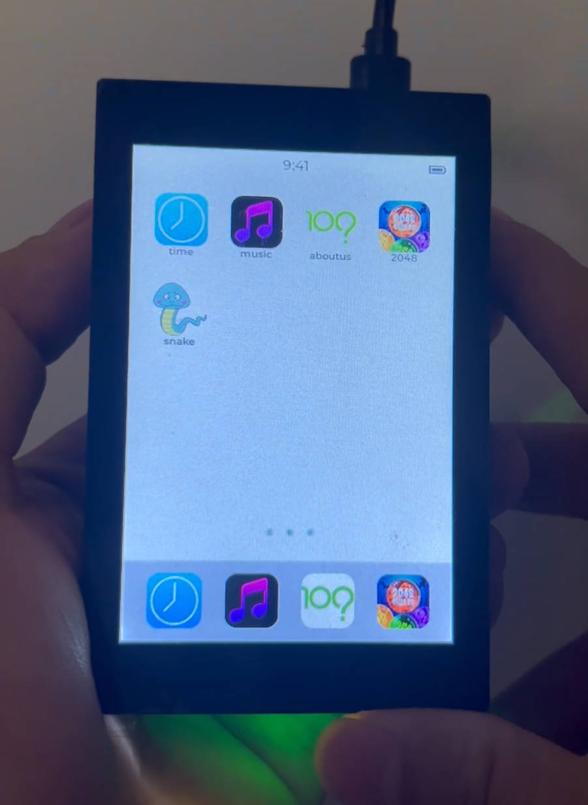
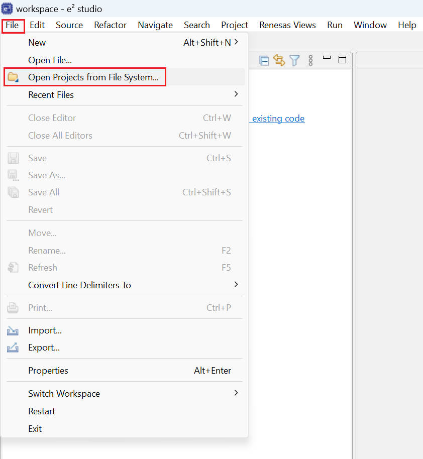
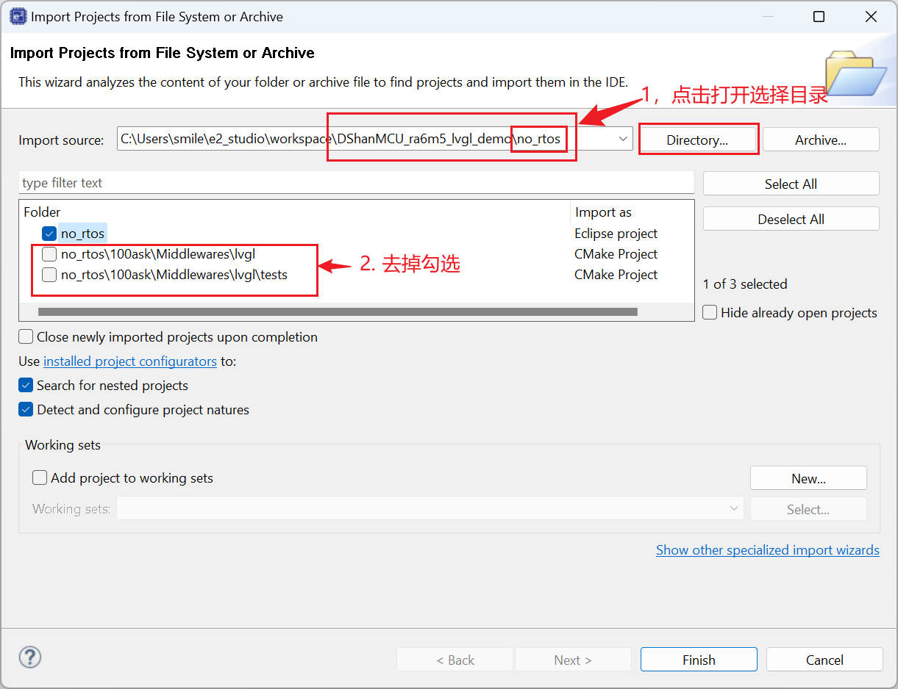

**瑞萨系列教程**： [http://renesas-docs.100ask.net](http://renesas-docs.100ask.net)

# DShanMCU-RA6M5 lvgl综合参考示例

- 软件：

  - e2_studio_2023-04
  - windows 11

- 硬件

  - [DShanMCU-RA6M5开发板](https://100ask.taobao.com)

- 开发板配套资料获取： [http://renesas-docs.100ask.net](http://renesas-docs.100ask.net)

## 导入工程

打开e2 stduio 之后，按照如下步骤导入项目工程：

# 关于作者
- 百问网官网：[http://www.100ask.net](http://www.100ask.net)
- 百问网官方论坛：[http://bbs.100ask.net](http://bbs.100ask.net)
- 微信公众号：百问科技
- B站：[https://space.bilibili.com/275908810](https://space.bilibili.com/275908810)
- CSDN：[https://edu.csdn.net/lecturer/90](https://edu.csdn.net/lecturer/90)
- 知乎：[https://www.zhihu.com/people/www.100ask/](https://www.zhihu.com/people/www.100ask/)
- 微博：[https://weibo.com/888wds](https://weibo.com/888wds)
- 电子发烧友学院：[http://t.elecfans.com/teacher/3.html](http://t.elecfans.com/teacher/3.html)

公司名称：深圳百问网科技有限公司
-  电话: 0755-86200561
-  技术支持邮箱: weidongshan@qq.com 
-  地        址: 广东省深圳市龙岗区布吉南湾街道平吉大道建昇大厦B座
-  邮        编: 518114 
